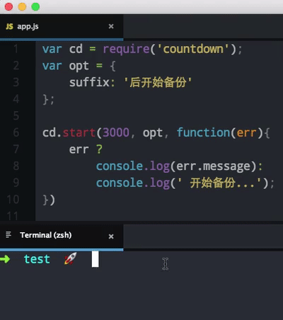
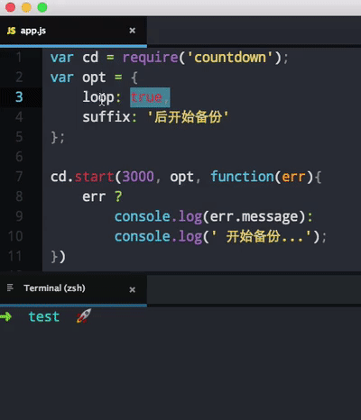

# Countdown
倒计时


#### Install
```
npm i node-countdown --save
```

#### Example
```js
var countdown = require('node-countdown');

countdown.start(5000, {suffix: '后开始备份'}, function(err){
    err ?
        console.log(err.message):
        console.log('开始备份...');
})
```

#### API
```js
countdown.start(time [, options, fn])

options = {
    prefix: '前缀',
    suffix: '后缀',
    // 循环任务
    loop: false,
    // 时间单位格式化数组
    // eg: ['years', 'months', ...]
    format: ['年', '月', '天', '小时', '分', '秒']
}
```

``time`` 倒计时时间，单位ms  
``options``  
* ``prefix`` 描述信息前缀
* ``suffix`` 描述信息后缀
* ``loop`` 是否建立循环任务，默认为``false``
* ``format`` 时间单位格式化数组  

``fn`` 倒计时完成后回调


#### Preview
``loop: false``  
  
``loop: true``  

